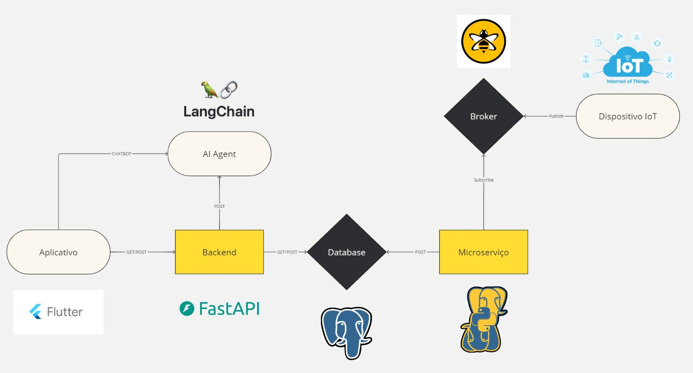
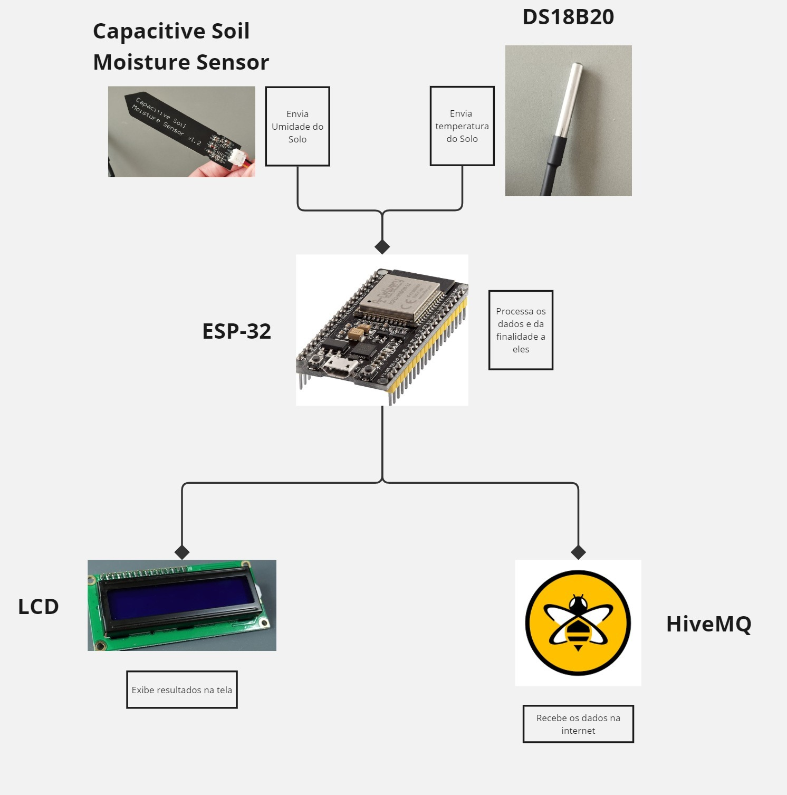
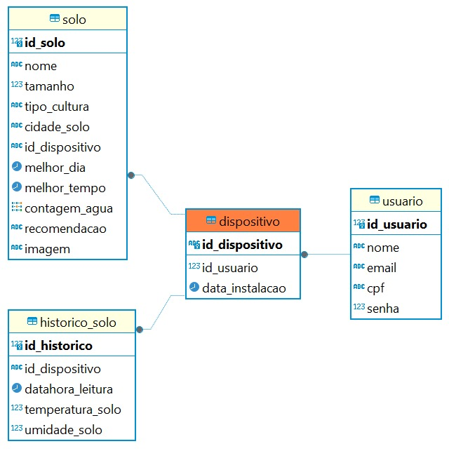
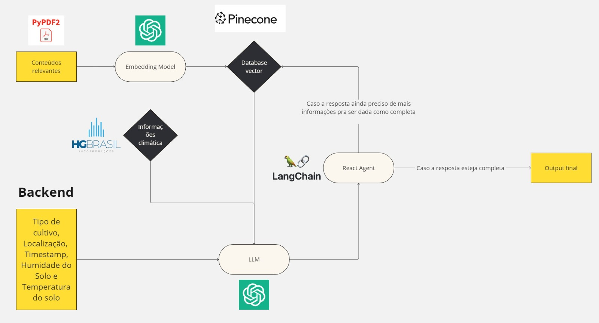

# 🌱 Katara

A Katara foi idealizada para oferecer aos pequenos produtores rurais uma solução simples e eficiente, focada no monitoramento do solo e na otimização da irrigação. O nome foi inspirado na palavra “água”, reforçando o compromisso do projeto com a redução do desperdício hídrico na agricultura, especialmente no Brasil, onde o setor consome a maior parte da água disponível. Com foco na região Centro-Oeste, uma das principais produtoras agrícolas do país, nossa plataforma utiliza tecnologias de IoT e IA generativa para ajudar os agricultores a maximizar a eficiência e a sustentabilidade de suas operações.

### Tecnologias Utilizadas
- Flutter  
- FastAPI  
- IoT (ESP32)  
- PostgreSQL  
- IA Generativa  
- HiveMQ  
- Figma  

---

## Índice

- 🌐 [Cenário Atual](#cenarioAtual)
- 🎯 [Nossa Solução](#nossaSoluçao)
- 📈 [Análise de Mercado](#analiseDeMercado)
- 💻 [Detalhamento de Tecnologias](#detalhamentoDeTecnologias)
- 📍 [Planos Futuros](#planosFuturos)
- 😎 [Nossa Equipe](#nossaEquipe)

---

## 🌐 Cenário Atual

### A Importância dos Pequenos Produtores Rurais
Os pequenos produtores rurais desempenham um papel vital na economia global e na segurança alimentar. Eles são responsáveis por grande parte da produção de alimentos consumidos no Brasil, garantindo a subsistência de milhares de famílias e contribuindo para a balança comercial do país.

### O Setor de Agricultura Sustentável no Brasil
O Brasil é um dos maiores consumidores de água no mundo para irrigação agrícola, com destaque para a região Centro-Oeste, onde grandes lavouras dependem fortemente de sistemas de irrigação. No entanto, o desperdício de água e a falta de tecnologias acessíveis criam desafios para a sustentabilidade do setor. A introdução de soluções tecnológicas que otimizem o uso dos recursos hídricos é essencial para garantir a eficiência produtiva e a preservação ambiental.

### Onde a Katara se Encaixa
A Katara surge como uma resposta direta às necessidades dos pequenos produtores, fornecendo uma solução acessível e tecnologicamente avançada. Com sensores IoT, previsão climática e inteligência artificial, a plataforma permite que os agricultores monitorem suas lavouras em tempo real e tomem decisões informadas sobre irrigação, garantindo maior produtividade e redução de custos.

### Desafios dos Pequenos Produtores Rurais
1. *Acesso limitado a tecnologias avançadas*  
   Muitos agricultores dependem de métodos tradicionais para decisões críticas, como irrigação, devido à falta de acesso a sensores e ferramentas modernas.  
   > *Fonte:* Embrapa (2021). ["Tecnologias de Monitoramento na Agricultura"](https://www.embrapa.br/).

2. *Irrigação ineficiente e desperdício de água*  
   Grande parte da água usada na agricultura é desperdiçada por falta de sistemas adequados, prejudicando a sustentabilidade e aumentando os custos operacionais.  
   > *Fontes:* FAO (2017), IPEA (2021).

3. *Falta de previsão climática precisa*  
   A ausência de informações meteorológicas hiperlocais impede a adaptação às condições regionais, reduzindo a eficiência.  
   > *Fonte:* Embrapa (2020). ["Mudanças Climáticas e Impactos na Agricultura Brasileira"](https://www.embrapa.br/).

4. *Acesso limitado à informação e suporte técnico*  
   A falta de apoio especializado dificulta a adoção de práticas eficientes.  
   > *Fonte:* Emater (2021).

---

## 🎯 Nossa Solução

A Katara é uma plataforma integrada, desenvolvida para combinar tecnologias de IoT, IA generativa e análise de dados, oferecendo aos pequenos agricultores uma ferramenta prática para otimizar a irrigação e reduzir o desperdício de água.

### Por Que a Katara É Diferente?
- *Simplicidade e acessibilidade*: Design intuitivo para usuários de todos os níveis de conhecimento técnico.
- *Solução holística*: Integração de sensores IoT, previsão climática e IA em um único ecossistema.
- *Sustentabilidade prática*: Redução do desperdício de água e aumento da eficiência produtiva.

### Funcionalidades Avançadas da Solução
1. *Monitoramento em Tempo Real*  
   Sensores IoT capturam dados ambientais como temperatura, umidade e pH do solo. As informações são enviadas para o aplicativo em tempo real, permitindo monitoramento constante.

2. *Recomendações Baseadas em IA Generativa*  
   A IA processa dados do solo e previsões climáticas, gerando recomendações personalizadas sobre quando e quanto irrigar.

3. *Notificações Proativas*  
   O sistema alerta os produtores sobre mudanças climáticas e períodos ideais para irrigação, garantindo decisões oportunas.

4. *Armazenamento e Análise de Dados*  
   Um banco de dados robusto registra o histórico de monitoramento, permitindo análises detalhadas e melhorias contínuas.

5. *Chatbot de Suporte Baseado em IA*  
   O chatbot oferece suporte técnico em tempo real, além de dicas sobre práticas agrícolas.

6. *Interface Intuitiva*  
   O aplicativo foi desenvolvido em Flutter, garantindo uma experiência de usuário clara e objetiva.

---

## 📈 Análise de Mercado

### Análise SWOT

A análise SWOT (Strengths, Weaknesses, Opportunities, Threats) é uma ferramenta estratégica usada para identificar os fatores internos (forças e fraquezas) e externos (oportunidades e ameaças) que afetam o desempenho de um projeto ou organização. Ela ajuda a visualizar os desafios e os pontos fortes para alinhar estratégias e alcançar os objetivos com maior eficiência. No contexto da AgroTech, a análise SWOT nos permite entender o cenário competitivo e avaliar como nossas soluções podem ser otimizadas para atender às necessidades dos pequenos produtores rurais.

#### *Forças (Strengths)*
- *Tecnologia acessível*: Uso de hardware IoT de baixo custo (ESP32) e frameworks populares como Flutter e FastAPI.
- *IA Generativa personalizada*: Fornece previsões precisas para irrigação, algo inovador para o setor.
- *Interface intuitiva*: Facilita o uso por pequenos produtores sem conhecimentos técnicos.
- *Sustentabilidade*: Redução do desperdício de água e aumento da eficiência agrícola.
- *Armazenamento de dados histórico*: Permite análises e melhorias constantes nas operações dos agricultores.

#### *Fraquezas (Weaknesses)*
- *Dependência de conectividade*: Pequenos produtores podem não ter acesso a redes estáveis em áreas remotas.
- *Capacitação tecnológica*: Dificuldade em educar os agricultores sobre o uso da solução.
- *Escalabilidade*: Custos e desafios para escalar a solução para regiões com climas e culturas diferentes.

#### *Oportunidades (Opportunities)*
- *Expansão de mercado*: Mercado crescente de tecnologias para a agricultura sustentável.
- *Demandas regulatórias*: Incentivos governamentais para práticas agrícolas sustentáveis.
- *Colaborações*: Parcerias com cooperativas e órgãos de assistência técnica (Emater, Senar).
- *Expansão global*: Adaptar a solução para mercados em outros países com necessidades similares.

#### *Ameaças (Threats)*
- *Concorrência tecnológica*: Grandes players com soluções similares, como John Deere e Climate FieldView.
- *Resistência cultural*: Agricultores podem hesitar em adotar novas tecnologias.
- *Variações climáticas extremas*: Condições climáticas imprevisíveis podem afetar a eficácia do sistema.

### Canvas de Proposta de Valor

O Canvas de Proposta de Valor é uma ferramenta de design estratégico que ajuda a mapear como um produto ou serviço cria valor para seus clientes. Ele se concentra em alinhar as necessidades dos usuários com as ofertas da solução, detalhando segmentos de clientes, problemas, ganhos e como a solução atende a essas demandas. Aplicado à AgroTech, o Canvas nos auxilia a identificar claramente como nossa plataforma pode resolver os principais desafios enfrentados pelos pequenos agricultores e destacar os benefícios que proporcionamos.

#### *Segmentos de Clientes*
- Pequenos produtores rurais interessados em otimizar a irrigação e a eficiência do uso da água.
- Cooperativas agrícolas e associações de produtores.

#### *Proposta de Valor*
- Solução acessível para monitoramento do solo em tempo real.
- Redução do desperdício de água e aumento da produtividade agrícola.
- Interface amigável que facilita o uso por agricultores com pouco conhecimento técnico.

#### *Canais*
- Aplicativo móvel (disponível para Android e iOS).
- Parcerias com cooperativas agrícolas e órgãos de extensão rural.
- Divulgação por redes sociais e eventos do setor agro.

#### *Relacionamento com Clientes*
- Suporte técnico via chatbot de IA integrado ao aplicativo.
- Treinamento inicial por vídeos e tutoriais no aplicativo.
- Interação contínua por notificações e alertas personalizados.

#### *Atividades-Chave*
- Desenvolvimento e manutenção da plataforma digital.
- Integração de sensores IoT no campo.
- Aprimoramento contínuo dos modelos de IA generativa.

#### *Recursos Principais*
- Sensores IoT para coleta de dados do solo.
- Equipe multidisciplinar com expertise em tecnologia e agricultura.
- Infraestrutura de banco de dados e API escalável.

#### *Parcerias Principais*
- Fabricantes de sensores e dispositivos IoT.
- Instituições de pesquisa agrícola (Embrapa, universidades).
- Cooperativas agrícolas e órgãos de assistência técnica.

#### *Fontes de Receita*
- Venda inicial de kits de sensores e assinatura mensal do aplicativo.
- Serviços adicionais, como relatórios personalizados e análises avançadas.
- Parcerias comerciais e programas governamentais.

#### *Estrutura de Custos*
- Desenvolvimento de hardware e software.
- Infraestrutura de servidores e armazenamento.
- Treinamento e suporte técnico aos agricultores.

---

## 💻 Detalhamento de Tecnologias

### Arquitetura da solução

    

Fonte: Material produzido pelo grupo Katara.

A arquitetura da solução Katara foi projetada para oferecer um fluxo eficiente e escalável, integrando IoT, processamento de dados em tempo real, inteligência artificial e um aplicativo móvel intuitivo. A seguir, detalhamos os principais componentes e como eles interagem.

---

#### *Visão Geral*

A solução utiliza dispositivos IoT para coletar dados diretamente do solo, que são transmitidos para um broker MQTT (HiveMQ). Esses dados são processados por um microserviço, armazenados em um banco de dados relacional (PostgreSQL) e acessados pelo backend, que oferece rotas para o aplicativo desenvolvido em Flutter. Além disso, o backend está integrado com um sistema de inteligência artificial que realiza cálculos para determinar a próxima irrigação e responde às dúvidas dos usuários por meio de um chatbot integrado ao aplicativo.

---

#### *Componentes Principais*

 *1. Dispositivos IoT*
- *Função*: Capturam dados diretamente das áreas de plantação, nesse protótipo, a temperatura e umidade do solo.
- *Tecnologia: Utiliza sensores conectados a dispositivos *ESP32.
- *Dados transmitidos*: Temperatura, umidade e pH do solo (opcional em futuras versões).

---

 *2. Broker MQTT - HiveMQ*
- *Função*: Gerencia a transmissão de dados entre os dispositivos IoT e o sistema backend.
- *Operação*:
  - *Publicação (Publish)*: Os dispositivos IoT enviam os dados coletados para o broker.
  - *Assinatura (Subscribe)*: O microserviço assina os tópicos para receber os dados em tempo real.
- *Tecnologia: *HiveMQ, um broker MQTT escalável e confiável.

---

*3. Microserviço - Psycopg*
- *Função*: Processa os dados recebidos do broker MQTT e os armazena no banco de dados.
- *Tecnologia: Desenvolvido em Python, utilizando a biblioteca *Psycopg para conectar e inserir dados no banco PostgreSQL.
- *Responsabilidades*:
  - Garantir a consistência dos dados.
  - Manter logs das transmissões recebidas para auditorias futuras.

---

 *4. Banco de Dados - PostgreSQL*
- *Função*: Armazena todos os dados coletados e processados.
- *Estrutura*:
  - Tabelas para dispositivos, solos e séries temporais
  - Otimizado para consultas frequentes realizadas pelo backend e pela IA.
- *Vantagens*:
  - Permite a criação de históricos detalhados para análises e previsões futuras, como o próprio dashboard.
  - Suporte robusto a transações e alta escalabilidade.

---

 *5. Backend - FastAPI*
- *Função*: Responsável por processar solicitações do aplicativo e interagir com o banco de dados e o sistema de IA.
- *Tecnologia: Desenvolvido em Python utilizando o framework *FastAPI.
- *Responsabilidades*:
  - Oferecer rotas para o aplicativo móvel (GET/POST).
  - Integração com o sistema de IA para obter as próximas recomendações de irrigação.
  - Gerenciamento de usuários e autenticação.

---

 *6. Sistema de Inteligência Artificial*
- *Função*: Determina a próxima irrigação com base nos dados coletados e nas condições ambientais.
- *Integração*:
  - O backend realiza requisições para a IA, que retorna a previsão e a recomendação personalizada para cada área de plantação.
- *Saídas*:
  - Quantidade de água necessária.
  - Melhor horário para irrigação.
  - Alertas de condições críticas.

---

 *7. Aplicativo Móvel - Flutter*
- *Função*: Interface principal para os usuários acessarem os dados e interagirem com o sistema.
- *Principais funcionalidades*:
  - Visualização em tempo real dos dados do solo.
  - Recebimento de notificações sobre a próxima irrigação.
  - Acesso ao histórico de condições do solo e ações realizadas.
  - Chatbot integrado para dúvidas e suporte técnico.
- *Design*: Desenvolvido com Flutter, garantindo uma experiência fluida e intuitiva para dispositivos Android e iOS.

---

*8. Chatbot com IA*
- *Função*: Responde a dúvidas dos agricultores e fornece suporte técnico sobre o uso da solução.
- *Tecnologia: Baseado em *LangChain, integrado ao backend.
- *Capacidades*:
  - Respostas personalizadas com base no conhecimento especializado passado por meio de manuais.
  - Suporte técnico para o uso do aplicativo e interpretação de dados.
  - Atualizações contínuas com aprendizado baseado nas interações dos usuários (plano futuro).

---

#### *Fluxo de Dados*

1. *Captura de Dados*:
   - Os sensores IoT coletam informações do solo e enviam para o broker HiveMQ via protocolo MQTT.
   
2. *Processamento Inicial*:
   - O microserviço assina os tópicos no HiveMQ, recebe os dados e os armazena no banco PostgreSQL.

3. *Armazenamento e Consulta*:
   - O backend acessa os dados no PostgreSQL para criar rotas de API que atendem ao aplicativo móvel e ao sistema de IA.

4. *Decisões da IA*:
   - O backend solicita à IA as próximas ações de irrigação, que são baseadas em manuais de cultivo, previsão do trempo, condições climáticas e data atual.

5. *Interação com o Usuário*:
   - O aplicativo móvel exibe os dados em tempo real, fornece notificações e permite interações por meio do chatbot com IA.

---

### Arquitetura de IoT - Katara

A arquitetura de IoT da Katara é projetada para coletar dados do solo em tempo real, processá-los e disponibilizá-los para análise e tomada de decisão. Essa estrutura combina sensores, um microcontrolador ESP-32, e integração com a nuvem por meio do HiveMQ.

Fonte: Material produzido pelo grupo Katara.

---

#### ⚙️ Componentes Principais

 *1. Capacitive Soil Moisture Sensor*
- Mede a *umidade do solo*.
- Envia dados de forma contínua ao ESP-32 para processamento.
- Utilizado pela sua precisão e baixo custo, ideal para aplicações agrícolas.

 *2. DS18B20*
- Um sensor digital que mede a *temperatura do solo*.
- Oferece alta confiabilidade e pode operar em condições extremas.

 *3. ESP-32*
- Microcontrolador central da arquitetura.
- *Funções principais*:
  - Processar dados recebidos dos sensores.
  - Enviar os dados para o display LCD para visualização local.
  - Transmitir os dados para a internet por meio do protocolo MQTT.
- Escolhido pela sua capacidade de conectividade Wi-Fi, custo acessível e desempenho eficiente.

 *4. LCD*
- Exibe os valores coletados pelos sensores em tempo real.
- Permite que os agricultores visualizem informações de forma local e rápida.

 *5. HiveMQ*
- Um *broker MQTT* que gerencia a transmissão de dados entre o ESP-32 e a nuvem.
- Proporciona uma troca eficiente de informações em tempo real.
- Essencial para garantir a integração do dispositivo IoT com o backend e o aplicativo móvel.

---

#### 📊 Fluxo de Dados

1. *Coleta de Dados*:  
   - O Capacitive Soil Moisture Sensor mede a umidade do solo.  
   - O DS18B20 mede a temperatura do solo.

2. *Processamento Local*:  
   - O ESP-32 processa os dados brutos dos sensores e os prepara para visualização e envio.

3. *Exibição Local*:  
   - Os dados são exibidos no LCD em tempo real para o agricultor.

4. *Envio para a Nuvem*:  
   - O ESP-32 utiliza o HiveMQ para transmitir os dados para o backend da Katara.  
   - A comunicação é feita via protocolo MQTT, garantindo rapidez e eficiência.

5. *Análise e Uso no Backend*:  
   - Os dados enviados para a nuvem são armazenados em um banco de dados PostgreSQL e usados para análises avançadas e previsões de irrigação.

### *Arquitetura do Banco de Dados*

O banco de dados da Katara foi projetado para armazenar, organizar e fornecer acesso eficiente às informações relacionadas aos usuários, dispositivos IoT, dados coletados do solo e histórico de leituras. Ele é estruturado em quatro tabelas principais:

Fonte: Material produzido pelo grupo Katara.

#### *1. Tabela usuario*
- *Descrição*: Armazena as informações dos usuários cadastrados no sistema.
- *Campos principais*:
  - id_usuario: Identificador único do usuário.
  - nome: Nome do usuário.
  - email: Endereço de e-mail do usuário.
  - cpf: Documento de identificação do usuário.
  - senha: Credenciais para acesso à plataforma.

---

#### *2. Tabela dispositivo*
- *Descrição*: Contém informações sobre os dispositivos IoT instalados pelos usuários.
- *Relacionamento*:
  - Cada dispositivo está vinculado a um usuário por meio do campo id_usuario.
- *Campos principais*:
  - id_dispositivo: Identificador único do dispositivo.
  - id_usuario: Referência ao proprietário do dispositivo.
  - data_instalacao: Data em que o dispositivo foi instalado.

---

#### *3. Tabela solo*
- *Descrição*: Representa as áreas de plantação monitoradas pelos dispositivos.
- *Relacionamento*:
  - Cada área de solo está associada a um dispositivo IoT por meio do campo id_dispositivo.
- *Campos principais*:
  - id_solo: Identificador único da área de solo.
  - nome: Nome descritivo da área monitorada.
  - tamanho: Dimensão da área de plantação.
  - tipo_cultura: Tipo de cultura cultivada no solo.
  - cidade_solo: Localização geográfica do solo.
  - melhor_dia e melhor_tempo: Recomendação gerada para a irrigação ideal.
  - contagem_agua: Volume de água utilizado.
  - recomendacao: Sugestões específicas de manejo.
  - imagem: Visualização associada ao solo (opcional).

---

#### *4. Tabela historico_solo*
- *Descrição*: Registra os dados coletados periodicamente pelos dispositivos IoT em tempo real.
- *Relacionamento*:
  - Cada registro no histórico está associado a um dispositivo IoT por meio do campo id_dispositivo.
- *Campos principais*:
  - id_historico: Identificador único do registro histórico.
  - id_dispositivo: Referência ao dispositivo que realizou a coleta.
  - datahora_leitura: Data e hora da coleta.
  - temperatura_solo: Temperatura registrada no solo.
  - umidade_solo: Umidade registrada no solo.

---

#### *Fluxo de Dados*
1. *Cadastro de Usuários e Dispositivos*:
   - Os dados dos usuários e dos dispositivos são registrados nas tabelas usuario e dispositivo.
2. *Monitoramento do Solo*:
   - Informações sobre áreas de plantação são armazenadas na tabela solo.
3. *Coleta de Dados*:
   - Os dispositivos enviam dados de temperatura e umidade, registrados na tabela historico_solo para análises futuras.
4. *Recomendações*:
   - Com base nos dados armazenados, o sistema gera recomendações personalizadas e otimizações para o manejo agrícola.
---

### 🧠 Arquitetura da AI

A arquitetura da AI utilizada na Katara combina modelos avançados de linguagem (GPT-4), ferramentas de recuperação de informações (RAG - Retrieval-Augmented Generation) e APIs externas para fornecer recomendações robustas e contextualizadas. Um dos principais diferenciais é o uso do *React Agent*, que faz múltiplas iterações para validar as informações e garantir a melhor resposta possível.

Fonte: Material produzido pelo grupo Katara.

#### *Componentes da Arquitetura*

1. *Modelo de Linguagem (LLM - OpenAI GPT-4)*  
   - Gera insights e previsões baseadas nos dados fornecidos pelo backend, bancos de dados e APIs externas.

2. *React Agent (Validador Inteligente)*  
   - Atua como um controlador inteligente que organiza e direciona as ferramentas necessárias para cada consulta.
   - Faz múltiplas "voltas" ou interações com as ferramentas disponíveis até alcançar um resultado final confiável e validado.
   - Sempre que encontra lacunas ou inconsistências nas respostas, busca mais informações para enriquecer e corrigir os resultados.

3. *RAG (Retrieval-Augmented Generation)*  
   - Recupera dados relevantes de um banco vetorial (ex.: Pinecone), incluindo informações previamente indexadas sobre solo, cultivos e práticas agrícolas, adicionando contexto às respostas.

4. *Integração com APIs Externas*  
   - A API da HG Brasil é usada para trazer dados meteorológicos atualizados, complementando a análise e previsão de irrigação.

5. *Pipeline de Dados do Backend*  
   - Inclui informações detalhadas como tipo de cultivo, localização, umidade do solo, temperatura e timestamps, que são a base para as análises e recomendações.

---

#### *Como o React Agent Garante o Melhor Resultado*

O React Agent é o coração da validação e integração na arquitetura da AI. Seu funcionamento é baseado em um ciclo iterativo inteligente:

1. *Recebendo a Solicitação*  
   Quando o usuário faz uma consulta ou quando a AI precisa gerar uma recomendação (ex.: "Qual o melhor momento para irrigar?"), o React Agent analisa os dados disponíveis no backend e no banco vetorial.

2. *Executando Ferramentas*  
   O React Agent identifica as ferramentas necessárias para responder à consulta (ex.: acessar a API de previsão climática ou consultar o banco vetorial). Ele organiza as chamadas em sequência, considerando dependências entre os dados.

3. *Iterações para Refinamento*  
   Caso o resultado inicial de uma ferramenta seja insuficiente ou inconclusivo, o React Agent repete o processo:
   - Faz novas consultas no banco vetorial para buscar mais contexto.
   - Pede ao LLM para reformular a pergunta ou buscar interpretações alternativas.
   - Recheca os dados de previsão climática, garantindo que estejam atualizados e adequados ao cenário específico.

4. *Feedback em Tempo Real*  
   Durante essas iterações, o React Agent interage continuamente com o LLM e as ferramentas, verificando se as respostas obtidas já satisfazem os critérios estabelecidos para a consulta.

5. *Output Final*  
   Quando o React Agent valida que todas as informações são consistentes e completas, ele gera o output final. Esse output é estruturado para ser claro, embasado e diretamente aplicável pelo usuário.

---

#### *Fluxo Simplificado da Operação*

1. *Dados do Backend*: O pipeline do backend fornece informações iniciais (tipo de cultivo, umidade do solo, temperatura, localização, etc.).
2. *Banco Vetorial (RAG)*: O React Agent consulta o banco vetorial para obter informações adicionais, como boas práticas agrícolas e históricos de solo.
3. *API de Previsão Climática*: A API HG Brasil traz previsões hiperlocais de tempo, necessárias para as recomendações.
4. *Iterações e Validações*: O React Agent valida cada resultado intermediário, refinando e corrigindo as respostas conforme necessário.
5. *Output Final*: A resposta final, validada e otimizada, é apresentada ao usuário no aplicativo.

---

#### *Vantagem do Ciclo Iterativo do React Agent*

O grande diferencial do React Agent é sua capacidade de lidar com consultas complexas e dinâmicas:
- *Adaptabilidade*: Ele ajusta suas ferramentas e estratégias com base nos dados disponíveis e na consulta feita.
- *Precisão*: O processo iterativo garante que os dados estejam corretos e as respostas sejam completas.
- *Confiabilidade*: Sempre que um dado parecer inconsistente ou faltar contexto, o React Agent buscará resolver essas lacunas antes de finalizar a resposta.

Essa abordagem robusta é essencial para atender às demandas de precisão e confiabilidade na irrigação e manejo agrícola oferecidos pela Katara.

## 📍 Planos Futuros

A Katara foi idealizada como uma plataforma com grande potencial de expansão e evolução, não apenas atendendo às necessidades atuais dos pequenos produtores rurais, mas também incorporando funcionalidades que os prepararão para desafios futuros. Nossa visão é criar uma solução cada vez mais robusta, personalizada e global. Abaixo, detalhamos nossos principais objetivos para o futuro da plataforma:

### *1. Adição de Novos Sensores e Funcionalidades*
Estamos comprometidos em expandir a gama de dados monitorados, aumentando a profundidade das análises e recomendações da plataforma.  
- *Monitoramento de nutrientes do solo*: Implementação de sensores capazes de medir a quantidade de nutrientes essenciais, como nitrogênio, fósforo e potássio. Isso permitirá que os agricultores ajustem suas práticas de fertilização de forma precisa, reduzindo desperdícios e custos.
- *Sensores climáticos mais avançados*: Desenvolvimento de sensores locais que forneçam dados como velocidade do vento, radiação solar e índice pluviométrico, otimizando ainda mais as decisões de manejo agrícola.
- *Integração com drones: Futuramente, planejamos integrar a *Katara com drones agrícolas para mapeamento aéreo das propriedades, possibilitando uma análise visual detalhada de grandes áreas.

### *2. IA Avançada e Modelos Preditivos*
A inteligência artificial continuará sendo o coração da Katara, e temos planos para melhorar significativamente sua funcionalidade:
- *Modelos de previsão mais detalhados*: Refinamento dos algoritmos para considerar uma gama mais ampla de variáveis, como tipos de solo, culturas específicas e impacto das mudanças climáticas em longo prazo.
- *Previsão de pragas e doenças*: Desenvolvimento de um sistema de IA capaz de identificar riscos de infestações de pragas e doenças baseando-se em padrões climáticos, históricos de cultivo e dados do solo.
- *Recomendações personalizadas de plantio*: Expansão das funcionalidades da IA para sugerir o momento ideal de plantio e colheita, levando em conta as condições regionais e climáticas específicas.

### *3. Expansão Geográfica e Adaptação a Novas Realidades*
Embora o foco inicial seja o Brasil, especialmente a região Centro-Oeste, queremos levar a Katara a outros mercados agrícolas.
- *Regionalização para outras regiões do Brasil*: Adaptação das previsões e algoritmos para atender às peculiaridades climáticas e culturais de regiões como o Nordeste e o Sul.
- *Expansão internacional*: Planejamos expandir para outros países da América Latina, como Argentina e Colômbia, que compartilham desafios semelhantes no setor agrícola.
- *Customização para culturas específicas*: Criação de pacotes de funcionalidade para culturas agrícolas predominantes em outras regiões, como trigo, milho e café.

### *4. Sustentabilidade e Economia Circular*
Queremos que a Katara não seja apenas uma ferramenta tecnológica, mas um agente transformador da sustentabilidade na agricultura:
- *Redução da pegada hídrica*: Implementação de relatórios que ajudem agricultores a mensurar a economia de água alcançada com o uso da plataforma.
- *Apoio a certificações sustentáveis*: Ajudar os produtores a obterem certificações como "Orgânico" e "Rainforest Alliance", provando práticas sustentáveis.
- *Parcerias com iniciativas verdes: Trabalhar com ONGs e governos para promover subsídios e incentivos fiscais para agricultores que utilizam a *Katara.

### *5. Suporte e Educação ao Usuário*
Nossa visão de futuro inclui uma interação mais próxima e enriquecedora com os produtores:
- *Academia Katara*: Criação de uma plataforma educacional com tutoriais, vídeos e workshops para capacitar os agricultores no uso da tecnologia.
- *Comunidade de usuários*: Desenvolvimento de uma rede colaborativa onde produtores possam compartilhar experiências, dicas e boas práticas.
- *Suporte 24/7*: Ampliação do chatbot para um sistema de suporte integral, com agentes reais disponíveis para ajudar os usuários.

### *6. Integração com Políticas Públicas e Incentivos Governamentais*
A Katara pretende colaborar diretamente com órgãos governamentais e instituições de pesquisa para maximizar seu impacto:
- *Parcerias governamentais: Integração da *Katara em programas governamentais de apoio à agricultura familiar, especialmente nas regiões mais carentes.
- *Relatórios para órgãos reguladores*: Desenvolvimento de dashboards que possam ser compartilhados com cooperativas e governos para promover políticas públicas mais alinhadas às necessidades reais dos agricultores.
- *Participação em feiras e eventos: Fortalecimento da presença da *Katara em feiras agrícolas, promovendo sua adoção em larga escala.

### *7. Automação e Agricultura 4.0*
A longo prazo, a Katara busca ser um dos líderes na transformação digital do campo:
- *Automação de sistemas de irrigação*: Conexão direta com equipamentos automatizados para executar ações baseadas nas recomendações do aplicativo, reduzindo a necessidade de intervenção manual.
- *Agricultura de precisão*: Uso de big data para prever padrões de cultivo e alavancar o desempenho agrícola.
- *Integração com Blockchain*: Implementação de rastreabilidade de produção, permitindo que consumidores conheçam a origem dos alimentos e práticas agrícolas adotadas.

Com essas iniciativas, a Katara pretende se consolidar como uma solução indispensável para os pequenos produtores, liderando a transição para uma agricultura mais inteligente, sustentável e economicamente viável.

---

## 😎 Nossa Equipe

O time por trás da Katara é composto por três profissionais dedicados a transformar a agricultura no Brasil:

- *Marco Ruas* - Desenvolvedor Frontend  
- *Lucas Vieira* - Especialista em Negócios  
- *Giovanna Britto* - Desenvolvedora Backend